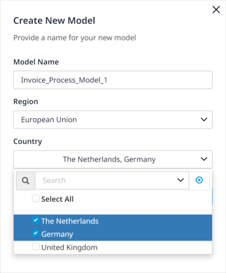
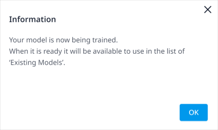

## 1 Introduction

{}[update doc links on Documentation tabs for components already released ]{}

Powered by AI and OCR technologies, the [Invoice Processing](https://marketplace.mendix.com/link/component/118389) app service can help you automate the processing of invoices in bulk. It supports invoices in the European Union and the United States.

### 1.2 Features

* Extract data from images of invoices in bulk and map data to an entity
* Support the invoices from United States and European Union regions
* Support [Mendix SSO](/appstore/modules/mendix-sso)

### 1.3 Limitation

* Currently only supports images in JPG and JPEG formats

### 1.4 Prerequisites

This app service works best with Studio Pro 8 versions starting with [8.18.5](/releasenotes/studio-pro/8.18#8185) and 9 versions starting with [9.0](/releasenotes/studio-pro/9.0).

## 2 Installation

1. Go to  the [Invoice Processing](https://marketplace.mendix.com/link/component/118389) component page in the Marketplace and download the *.mpk* file.
2.  To add the Invoice Processing app service to your app in Mendix Studio Pro, follow these steps:
    1.  In the **App Explorer** (in Studio Pro 9) or the **Project Explorer** (in Studio Pro 8), right-click the app.
    2.  Click **Import module package**, and then select *InvoiceProcessing.mpk*.

        

        In the **Import Module** dialog box, **Add as a new module** is the default option when the module is being downloaded for the first time, which means that new entities will be created in your app.

        {}If you have made any edits or customization to a module that you have already downloaded, be aware of the **Replace existing module** option. This will override all of your changes with the standard Marketplace content, which will result in the creation of new entities and attributes, the deletion of renamed entities and attributes, and the deletion of their respective tables and columns represented in the database. Therefore, unless you understand the implications of your changes and you will not update your content in the future, making edits to the downloaded modules is not recommended.{}

    3. In the **Import Module** dialog box, click **Import**.
    4. Wait until a pop-up box states that the module was successfully imported. Click **OK**.
    5. Open the **App Explorer** or **Project Explorer** to view the **InvoiceProcessing** module. You can also find the app service in the **Document Data Capture Service** category in the **Toolbox**.
    
## 3 Configuration

The Invoice Processing app service is a premium Mendix product that is subject to a purchase and subscription fee. To successfully deploy an app that uses the Invoice Processing app service, you need to get a valid combination of access and secret keys and configure them as constants in the module.

### 3.1  Subscribing to Get Keys

1. On the [Invoice Processing](https://marketplace.mendix.com/link/component/118389) component page in the Marketplace, click **Subscribe** to order a subscription or click **Try for Free** to start a trial.
2. Fill in the [Technical Contact](/developerportal/collaborate/app-roles#technical-contact) information (**First Name**, **Last Name**, **Email Address**), billing account information, and other required information, and then place the order. The Technical Contact receives an order confirmation email. 

    For the trial, you do not need to fill in this information.

3. Click the link in the order confirmation email to go to the Marketplace [Subscriptions](/appstore/general/app-store-overview#subscriptions) page and log in with your Mendix account. The **Subscriptions** page gives an overview of all the subscriptions of your organization.
4. Click **Invoice Processing** to open the [service management dashboard](/appstore/general/app-store-overview#service-management-dashboard).
5. Follow the instructions in the [Creating Binding Keys](/appstore/general/app-store-overview#creating-binding-keys) section in the *Marketplace Overview* to create binding keys.

### 3.2 Configuring Keys for Application Deployment

1.  In the **App Explorer** or the **Project Explorer**, go to **InvoiceProcessing** > **Configurations**. **Access_Key**, **Secret_Key**, and **Encryption_Key** are defined as constants.

    

2. For each constant, double-click the constant, enter the key that you saved, and click **OK** to save the changes.

## 4 Usage

To use the Invoice Processing app service, first you need to create a model, then create an [Import Mapping](#mapping-file) using a sample invoice. Import Mapping defines how to map extracted data from images to an entity. After Import Mapping creation, you include the [invoice processing service activity](#extraction-activity) into a microflow. This microflow should be set up to accept set of invoice image(s), your trained model, and Import Mapping. Microflow should extract data from the images in bulk and then map the data to an entity using the Import Mapping that you created.

### 4.1 Training a Document Model {#document-model-training}

1.  Perform the following steps to log into the **Document Model Training** application:
    1.  Log into the Marketplace with your Mendix account.
    2.  Go to **My Marketplace** and click [Subscriptions](/appstore/general/app-store-overview#subscriptions) on the left navigation menu. The **Subscriptions** page gives an overview of all the subscriptions of your organization.
    3.  Click **Invoice Processing** to open the [service management dashboard](/appstore/general/app-store-overview#service-management-dashboard).
    4.  Click **Manage Instance** to open the **Document Model Training** application.

        

    5. Log into the [Document Model Training](https://datacapture-appservices.mendixcloud.com/login.html) application using your Mendix account.
    
2.  Select appropriate Invoice Processing **Environment** from the dropdown to show the **Existing Models** list.

    

    {} The model is ready to use only when the **Status** of this model is **Published**. {}

3.  To train a new model, click **Create New Model** on the page. The **Create New Model** dialog box opens.

    

4.  Enter a unique **Model Name**, select a **Region**, and then select **Country** specific to the selected Region. You can select multiple countries for a given Region. Click **Create Model**.
    
    {} The model name should not exceed 55 characters. You can only use characters (a-z, A-Z), numbers (0-9), and underscore (\_). {}
   
5. An **Information** pop up window appears notifying the user that the model is being trained.

    

6. Click **OK**. The new model appears in the **Existing Models** list with the status **In Progress**.
7. Click **Refresh** and wait until the **Status** of the model becomes **Published**.
8. Once the model is published, it is ready to use.

### 4.2 Creating an Import Mapping{#mapping-file}

You need to use an [Import Mapping](/refguide/mapping-documents#import-mappings) to populate the extracted data into an entity. If necessary, you can further process the entity with [event handlers](/refguide/event-handlers).

1.  To create an Import Mapping, you need a JSON structure. Perform the following steps to generate the JSON structure:
    1.  Log into the [Document Model Training](#document-model-training) application with your Mendix account.
    2.  Click appropriate Invoice Processing **Environment** to show the **Invoice Models** list.
    3.  Select your trained model. Make sure that the **Status** of the model is **Published**. Note down the **Model Id**. You will need it when you [extract data with the trained model ](#extraction-activity).
    4.  Click **Download JSON Structure**. The **Generate JSON Structure** dialog box opens.
    5.  Drag the sample invoice into the box where it says **Drag & Drop your image file here**. You can also click the **Browse** button and select the file.

        

    6. Click **Download** to get the JSON structure.
2.  To add the JSON structure to your app, perform the following steps:
    1.  In the **App Explorer** or **Project Explorer**, right-click the module or the folder where you want to add the JSON structure.
    2.  From the pop-up menu, select **Add other** > [JSON structure](/refguide/json-structures).

        

    3. In the **Add JSON Structure** dialog box, enter a **Name** for the JSON Structure and click **OK**. The **JSON Structure** dialog box opens.
    4. In the **JSON Snippet** box, add the content of the JSON mapping file that you generated. The system converts the JSON snippet into a schema structure automatically. You will need this schema structure to create the Import Mapping.
    5. Click **OK** to save the changes and close the dialog box.
3.  To create the Import Mapping, perform the following steps:
    1.  In the **App Explorer** or **Project Explorer**, right-click the module or the folder where you want to add the Import Mapping.
    2.  From the pop-up menu, select **Add other** > **Import mapping**.
    3.  In the **Add Import Mapping** dialog box, enter a **Name** for the Import Mapping and click **OK**. The **Select schema elements for import mapping** dialog box opens.
    4.  For **Schema source**, select **JSON structure** and **Select** the JSON structure that you created.

        

    5. Click **OK** to save the changes and close the dialog box.

### 4.3 Extracting the Data with the Trained Document Model {#extraction-activity}

1.  In the **Toolbox**, drag **Invoice Processing** activity from the **Document Data Capture Service** category into your microflow.

    

2. Create a list of image that inherits from `System.Image`. Images where data are extracted should be passed as a list, as shown in the microflow above.
3.  Double-click the **Invoice Processing** activity to open the dialog box.

    

4.  Click **Edit** to enter the **Model Id** of your model.
5. Click **Edit** to select the **Image List** which inherits from `System.Image`.
6. In the **Mapping** box, **Select** the Import Mapping that you created to define how extracted data should be mapped into an entity.
7. Click **OK** to save the changes and close the dialog box.

{} Optionally for further automation, add [event handlers](/refguide/event-handlers) on the entity where you populate the extracted data. You can call your own microflow to process the extracted data when inserted into the entity. For example, you can modify, validate, and pass the data to next steps. By dong this, you can achieve full end-to-end automation.{}

### 4.4 Checking Statistics on the Service Dashboard

The **Usage** dashboard shows the real-time statistics about the usage of an app service. Perform the following steps to check the real-time statistics:

1. Log into the Marketplace.
2. Go to **My Marketplace** and click [Subscriptions](/appstore/general/app-store-overview#subscriptions) on the left navigation menu. The **Subscriptions** page gives an overview of all the subscriptions of your organization.
3. Click **Invoice Processing** to open the [service management dashboard](/appstore/general/app-store-overview#service-management-dashboard). On the **Overview** tab, the **Usage** dashboard shows the real-time statistics.

## 5 Technical Provider{#technical-provider}

The AI and OCR technologies used by Invoice Processing Service are powered by [ABBYY&reg;](https://www.abbyy.com). Application includes ABBYY® FlexiCapture® 12 SDK © 2019 ABBYY Production LLC., and also that ABBYY and FLEXICAPTURE are either registered trademarks or trademarks of ABBYY Software Ltd. and cannot be used without prior written consent of ABBYY Software Ltd.

